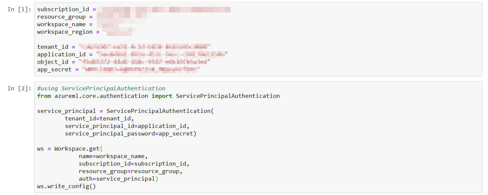

# Creating Service Principal for MLOPS - AzureML
 

</img>

 

</img>

 

</img>

 

</img>

 

</img>

 

</img>

 

</img>

 

</img>

 

</img>

 

</img>

 

</img>

 

</img>

 

</img>

 

</img>

 

</img>

 

</img>

